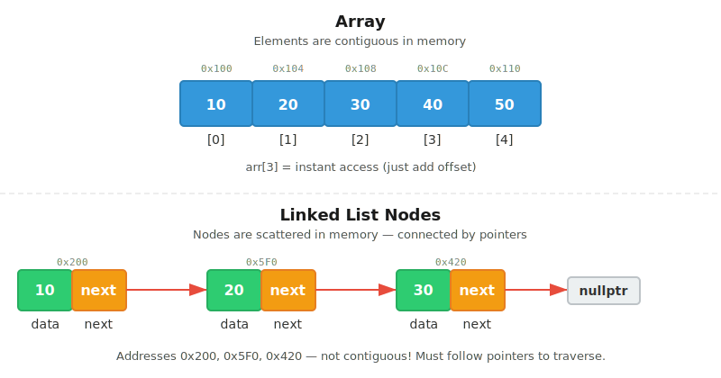
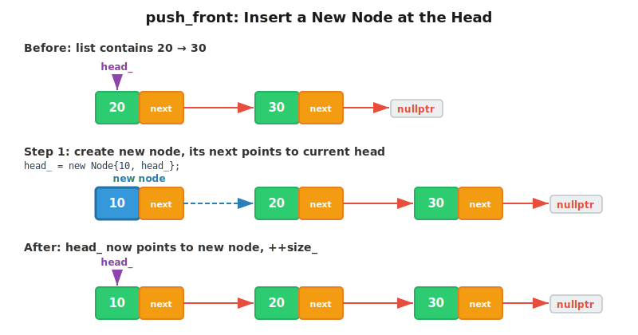
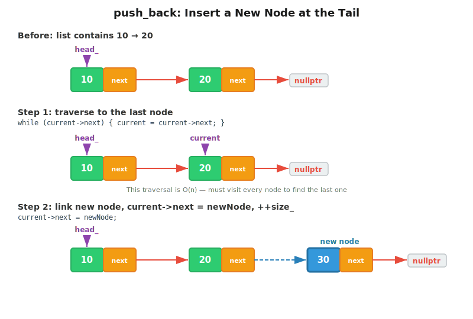
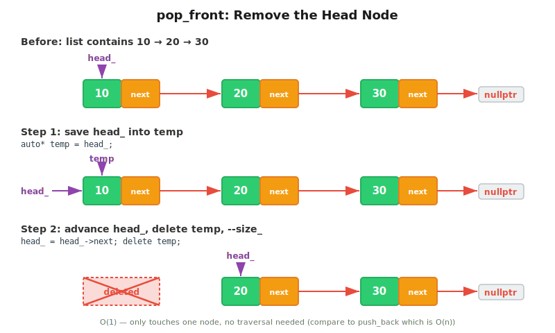
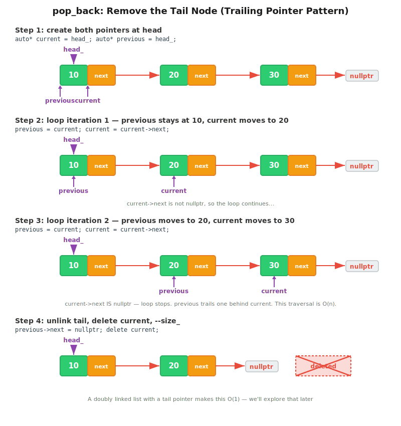
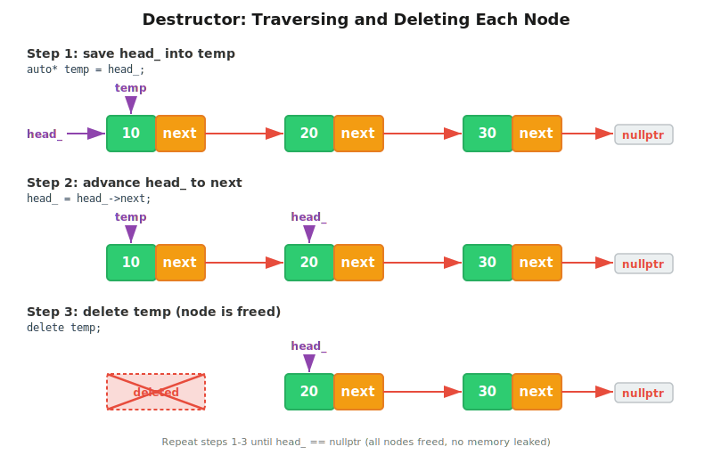

# CT7 -- Header Diagrams

Conceptual diagrams referenced from `SinglyLinkedList.h`.

---

## 1. Node vs. Array
*`SinglyLinkedList.h` -- why linked lists exist and how nodes differ from contiguous arrays*

---

## 2. push_front -- O(1)
*`SinglyLinkedList.h` -- create node, point to old head, update head*

---

## 3. push_back -- O(n)
*`SinglyLinkedList.h` -- traverse to end, link new node*

---

## 4. pop_front -- O(1)
*`SinglyLinkedList.h` -- save head, advance head, delete old*

---

## 5. pop_back -- O(n)
*`SinglyLinkedList.h` -- traverse to second-to-last, delete last*

---

## 6. Destructor Walk
*`SinglyLinkedList.h` -- walk from head to tail, deleting every node*

